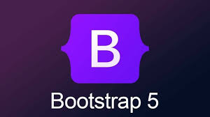
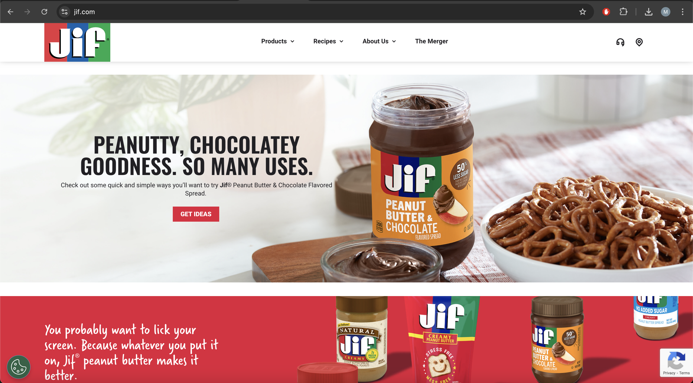
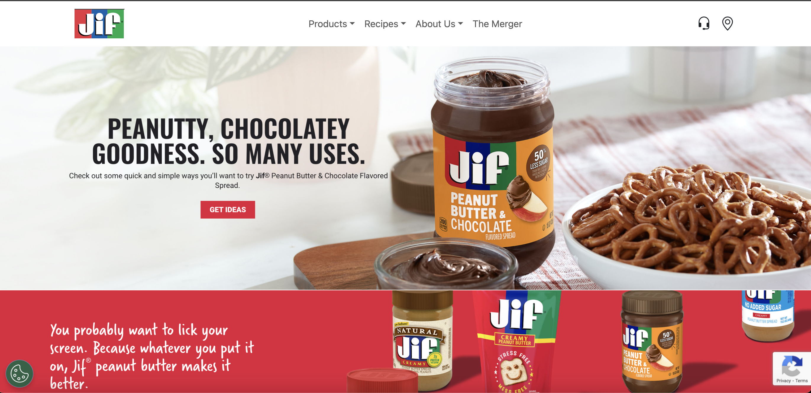

As Software Engineers, we often aspire to make user friendly, beautifully-designed websites, in a relatively short period of time. While one option would be to hack together a site with raw HTML and CSS, it is simply not the most efficient way to build. This is especially true when debugging for different browsers or screen sizes. Bootstrap 5 is a UI framework that offers a solution to this problem. When I first started with Bootstrap 5 I thought it was going to be similar to learning a new language. But after a few trial and error web development sessions I have come to the conclusion that it is worth it, given the few challenges it poses with the relatively large benefit.

## Advantages
Despite the daunting idea of learning to use a development tool that may provide fewer benefits than it is worth, Bootstrap’s classes and different components have truly increased the speed and efficiency of my web development. The UI framework has saved me a lot of time when putting together simple web pages, and in my opinion they look just as good, if not better than it would have been grinding out raw HTML and CSS. A tool I found particularly useful was Bootstrap’s navbar components. I have used it for several web pages in the last week and each time it took less than a few minutes to implement. Another tool I found beneficial was Bootstrap’s flex utilities. This was especially helpful for my web pages that often needed a centered photo for the background. I did not need any CSS, and it really was as easy as applying the Bootstrap classes.

## My Experience
The screenshots below are of the JIF peanut butter website. The one above is the original website, and the one below is my recreation of it using Bootstrap-5. With no CSS, the websites look pretty similar, and took me no more than 10 minutes to recreate.

## Conclusion
Anyone who has worked with HTML and CSS understands the tediousness required to get every button, link, or layout exactly the way they want it. With Bootstrap’s pre-made styles, and easy implementation, it is an obvious choice for any web developer that values their time. Of course customization will always require more time and work to implement, but for larger projects and redundant simple tasks it is truly a game changer. Ultimately, the decision to use Bootstrap-5, like anything, is going to depend on the preferences of the engineers behind it, but its efficiency and simplicity are incontrovertible.
