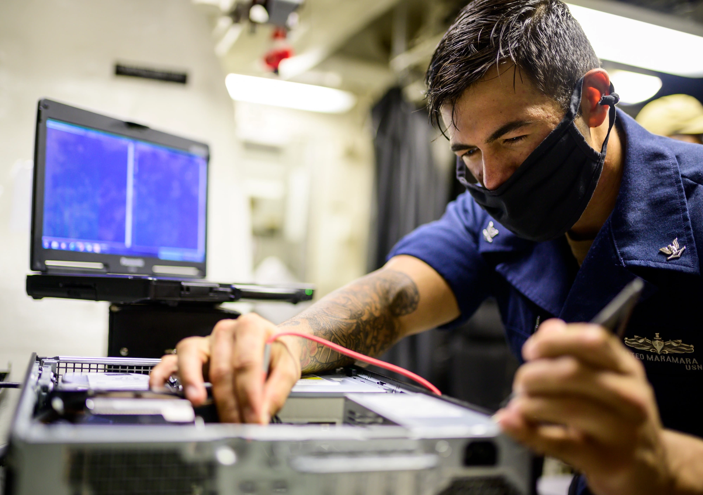

Growing up I spent much of my time outdoors where I was far removed from the world of technology I live in today. It wasn’t until my time in the Navy where I was introduced to the field of Information Technology. As an Information Systems Technician Second Class(IT2), I learned skills such as system administration, communications and cybersecurity. This exposure to the intricacies of the technology sector gave me an appreciation for all of the different ways IT infrastructure is interwoven with our daily lives and eventually led me to pursue a career in software engineering.

My journey into software engineering is built upon my technical background as a Navy IT. As a system administrator, cybersecurity training petty officer, and communications operator I was responsible for maintaining IT infrastructure under high stakes conditions. Now, as I transition into student life as a computer science major, I recognize the connections between innovative software and cybersecurity. While I am eager to master new programming languages, web development, and explore artificial intelligence, I will continue to leverage my technical background by using the best security practices within my career in software engineering. My ultimate vision is to create scalable, innovative software to make lives more efficient while maintaining confidentiality, integrity and availability.

My goal is to become a software engineer and my dream is to contribute to impactful software systems that shape society and make lives easier. Whether I am collaborating with others on a project, or leading from idea to deployment, my ambition to use my technical skills and passion for innovation will be my fuel to make an impact and solve meaningful problems within the technology sector. I am excited for every step of my unique software engineering journey, as each challenge will serve as a learning experience and ultimately better prepare me for the next obstacle that lies ahead. By embracing each challenge as an opportunity, I look forward to bringing new ideas, consistent work ethic, and a positive attitude to the software engineering industry.

