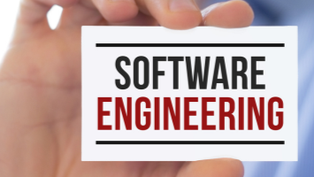

---

## Software Engineering I: A Reflective Essay

Prior to taking Software Engineering I, I thought software engineering consisted of writing code that implements data structures and algorithms. After reflecting on this semester, I think software engineering encompasses a more diverse set of responsibilities. Namely, Issue Driven Project Management (IDPM), configuration management, and ethics, which all played roles vital to my success in the class, and within my final group project. Like any goal worth pursuing, there were challenges. However, I was lucky to have helpful teammates and instructors to navigate the obstacles in Software Engineering I.

---

## Issue Driven Project Management (IDPM)

Issue Driven Project Management (IDPM) helped my group and I stay organized during our final project, manoaconnecttb. Having broken the development down into three milestones, we assigned issues for each task that needed to be completed. Additionally, with each issue that was assigned, we estimated how long it would take to implement and tracked the actual amount of time it took to complete. At first, tracking everything was overwhelming. However, once we got the momentum going with the first few issues it became much easier.
Ultimately, IDPM guidelines made the entire process of building manoaconnecttb easier because of the planning, coordination, and tracking that took place within my team. Having to think through each issue and estimate the length of time to complete helped me consider the potential subtasks, dependencies, and potential for bugs within each issue. Most importantly, IDPM made working on the project with my team a much smoother process. Planning which components that needed to be worked on, and assigning the task to a single group member helped us avoid merge conflicts and stepping on each other's toes in general. By the final milestone, my team and I were much better at predicting what was feasible with the amount of time we had to complete it.

### Configuration Management

With a total of six team members working on manoaconnecttb, version control was crucial. Github made configuration management easier, but that didn’t mean we didn’t face any challenges. Using different branches helped us stay organized. However, ESLint errors and merge conflicts created roadblocks in our vercel database. After a few database errors that resulted in setbacks for all team members, we began to take configuration more seriously. Consequently, we were much more strict about enforcing the rule that a team member who didn’t create the pull request must check it for errors before merging to the main branch. Additionally, Githubs visibility of issues, commits, and pull requests made it easier to retrace our steps and debug issues when they did come up. Nonetheless, Github was a reliable platform that gave us no technical problems and helped us work through our project in the most organized way that we could.

---

### Ethics

Despite the ethics module being short and unexpected, it made me think about the pragmatic ethical considerations that should be taken into account when working in the software engineering field. I think that is one of the reasons having principles established within a company's ethical guidelines is so important. Doing this will create a more accessible criteria when assessing team members for promotions. Additionally, by assessing factors outside of technical performance, we can have a broader, greater understanding of what makes a team member a good manager or engineer. Moreover, companies' ethical policies are only a starting point. As software engineers, we must have personal codes of ethics so we can make decisions for ourselves and our users with integrity. While ethical decisions in other fields may have more oversight, software engineers have a responsibility to start conversations around ethical considerations when deploying code that will directly affect users. Since software is scalable, these conversations can potentially have an impact on millions of people.

---

### Final Reflection

Software Engineering I was as challenging as it was rewarding. It gave me the tools to start engineering websites, discuss ethics, work with my team using IDPM guidelines, and the structure to practice functional programming on my own. However, I could not have fully absorbed any of these concepts without hours of practice alone. Despite the vast amount of knowledge gained during this course, my greatest takeaway is that the amount of work put into a project will usually determine the kind of result one gets. Ultimately, whether I am working on a startup, personal project, or within a team like in manoaconnecttb, I will carry this takeaway with me whilst always considering my instructors, teammates, and potential users.

---
