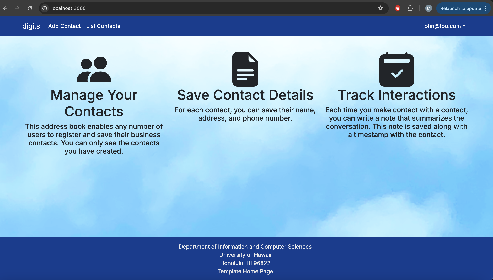
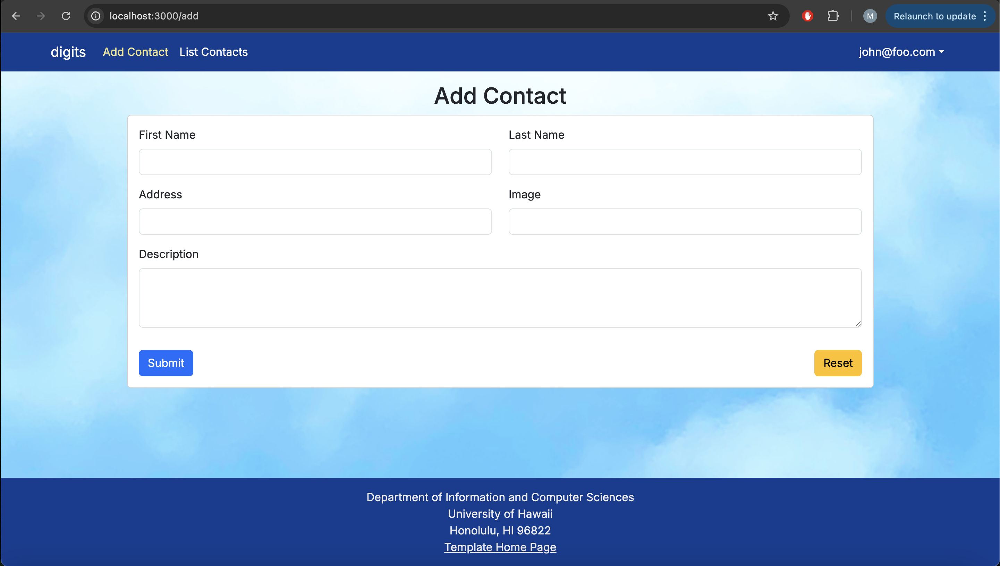
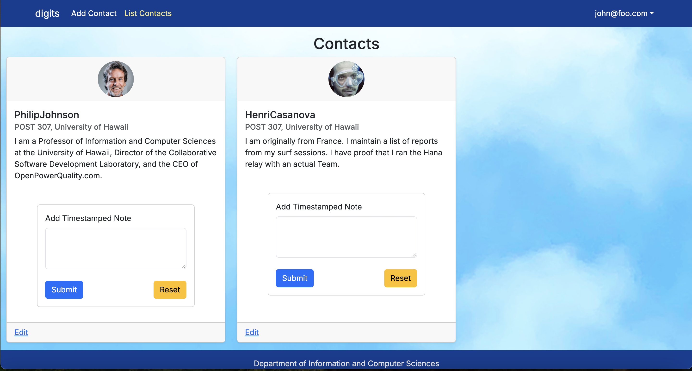
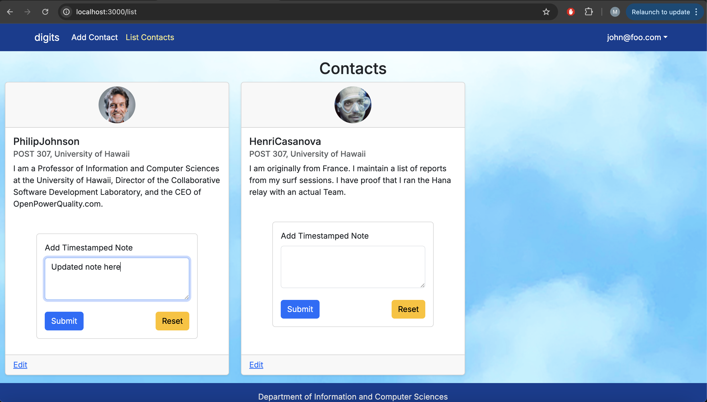

**Digits** is a contacts and notes management application I built as part of the ICS 314 course at the University of Hawaiʻi. Users can log in securely, add new contacts with details like name, address, image, and description, and attach notes to each contact to track interactions or personal reminders.

Each user can only see and manage their own contacts and notes, while administrators can view all users and their contacts. The app uses modern technologies including **Next.js**, **Prisma ORM**, **PostgreSQL**, and **TypeScript** to ensure scalable, maintainable, and performant development.

---

### 🖼 Screenshots

**Home Page:**


**Add Contact Page:**



**List Contact Page:**



**Add Note on Contact:**



**List Contact Page (with Notes):**


---

### 💻 Features

- 🔐 Secure login with NextAuth  
- 📇 Add, edit, and delete contacts  
- 📝 Attach timestamped notes to contacts  
- 🧑‍💼 Admin interface to view all users and contacts  
- 📱 Fully responsive with React Bootstrap  

---

### 🚀 Installation Instructions

1. **Clone the repository:**

```bash
git clone https://github.com/mateoMaramara/digits.git
cd digits
