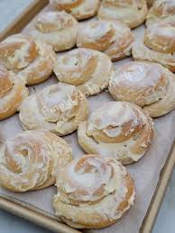

 The Kapuna Project is something I completed for my Food Science class using Google Sites. I was able to showcase the cultural, personal, and nutritional significance of one of my favorite family recipes. The recipe was passed down from my great-grandmother, and has been a staple in my family for every generation since. Growing up, I often shared it with my sisters, splitting a piece for breakfast or as a snack. While there are softer, sweeter, and more buttery variations of Ensaymada available in Filipino-owned bakeries here in Hawai’i, my grandma's version remains my favorite because it ties me to my family and heritage.
 
The site includes a section called “The Four Pillars of a Healthy Diet”, which elaborates on the importance of balance, variety, moderation and adequacy as they relate to nutrition. There is also a section that explains factors that influence my food choices such as cultural influences as well as physical and emotional states and how they affect nutrition. The bottom section includes nutritional information such as the calories per serving and the macronutrients, protein, carbohydrates, and fats. You can read more at the URL provided at the bottom of this page.

---

<a href="https://sites.google.com/hawaii.edu/mateo-maramara/home">Kapuna link</a>
