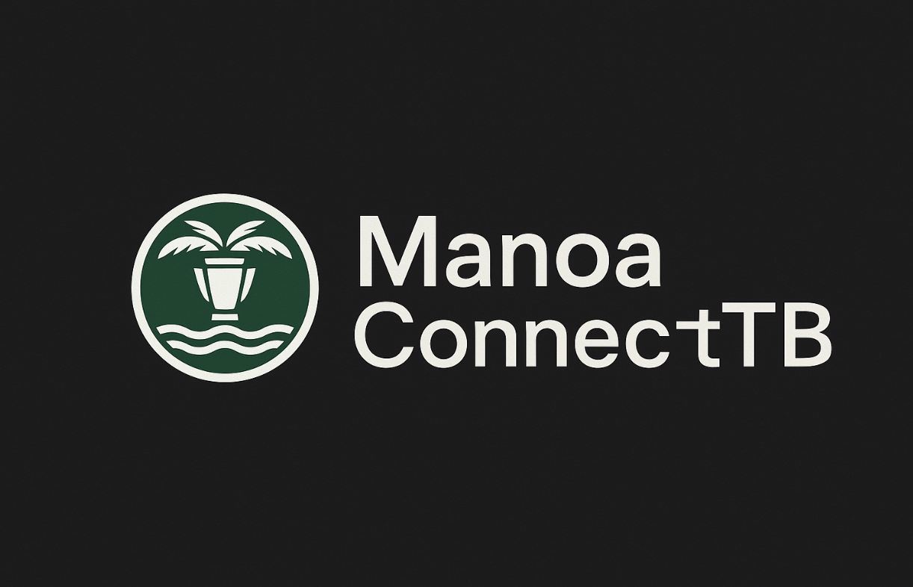
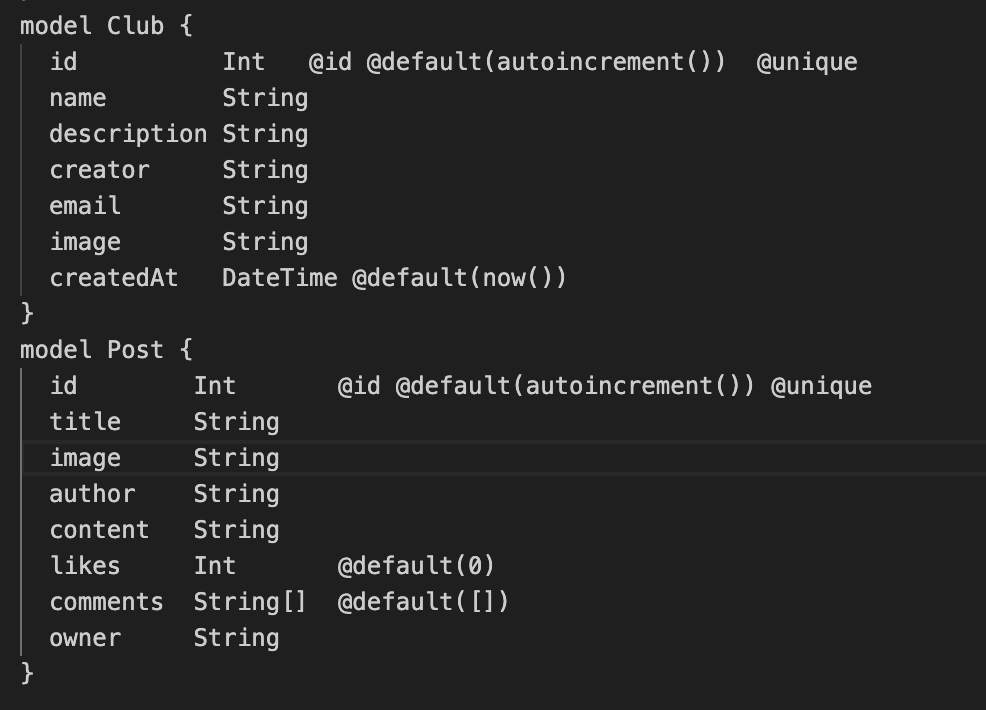
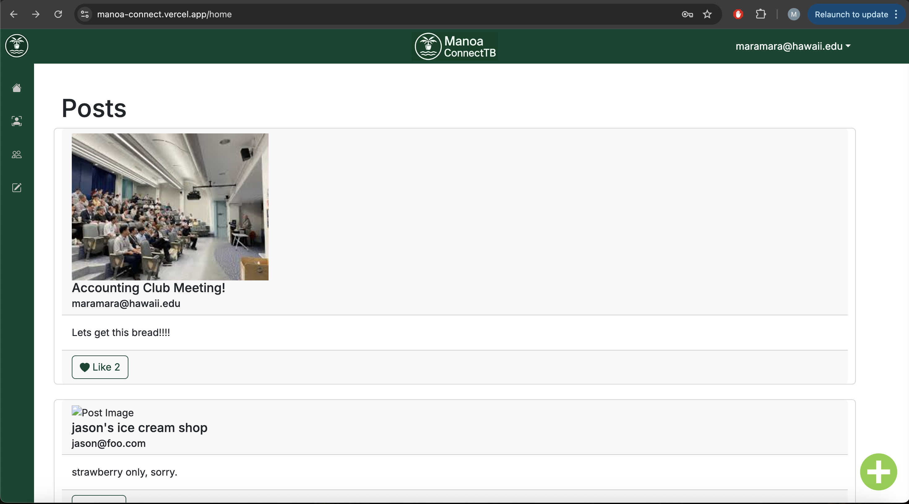

### My Contribution:
My primary role in the ManoaConnect project was designing and managing the database. The role entailed ensuring all of the club and user data could read and write to the vercel database. Since I was the only team member with a Vercel pro account, I had to make sure all of the user data was correctly writing to the database. This made me responsible for backend schema design, database seeding, migrations, and live data connectivity.

---

### Reading and Writing to the Database
I built the foundational schema for our app using schema.prisma. This file defined models like Club, User, and Post. Additionally, I implemented full functionality for Clubs using Prisma and Next.js API routes. This allowed users to create new clubs and remove old clubs. Below is an example of Club and Post:

---

### Design

In addition to ensuring ManoaConnect could read and write new users, clubs, and posts to the database, I designed different aspects of the website. While implementing functions and migrating data was an incredible learning experience, design was my favorite part of the final project. Using ChatGPT, I generated several mockup ideas for the ManoaConnect logo. Ultimately, we decided on using green and white for the colors. All of the logos, colors, and side bar functions were consistant across our site. Below is a screenshot of the posts page. You can see our logo in the top left and center of the navbar.

### What I Learned

Throughout the course of this project, there were victories and setbacks. Learning the different aspects that go into full stack development and backend deployment gave me a much broader perspective on web development. The biggest lessons I learned during the project were to stay organized and communicate when working with a team. While I was incredibly lucky to have a team of good communicators, every challenge we faced was due to a communication error. When six group members work on a small list of components, ensuring there is no overlap when assigning issues is crucial. Overlooking such a critical aspect of software development could lead to merge conflicts or database errors. Additionally, when we did run into errors we were able to recover quickly because we were organized with our issue tracking. This level of organization helped us retrace our steps and see where errors occured.

### Conclusion

ManoaConnect was a learning experience. During the project I got the opportunity so work on a full stack web application. More importantly, I got to practice doing so with a team. In my opinion, the real lessons did not come from database tasks or design. The majority of the lessons I learned can all be traced back to my ability to communicate with my team. After extensive coding, communication, organization, and command lookups, I believe this project prepared me for the challenges that I will face in industry level development. While much of the project was tedious, it was also fun designing the website and working through problems with my team.

---
[More information on ManoaConnect](https://manoaconnecttb.github.io/)

[Link to ManoaConnect website](https://manoa-connect.vercel.app/)
