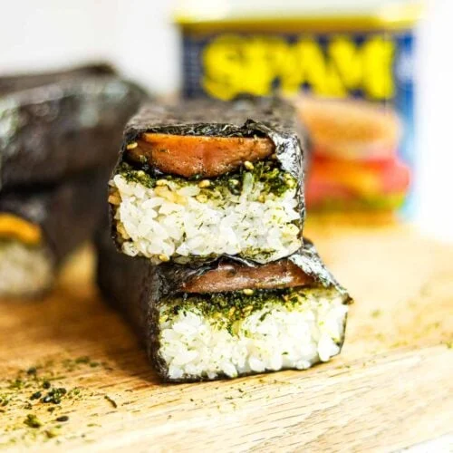

This is a program in C I made during my ICS 212 class. The purpose of the assignment was to generally practice programming concepts like for loops, while loops, and conditional statements. The program is supposed to print numbers from one to one hundred, with the caveat that specific numbers would be replaced with a string of my favorite food, spam musubi. All of the numbers divisible by 3 print “Spam”, all the numbers divisible by 7 print “Musubi”, and all of the numbers divisible by 7 and 3 print “SpamMusubi”. 

One key concept that this assignment was good practice for was the and, and or operators. Prior to this assignment I had a strong fundamental knowledge of for and while loops, but this project really solidified the and, and or operators into my memory. This project was also fun because I got to personalize it to my favorite food. To me, it is a good example of how programming does not always have to be serious, and it can be used to practice career skills and have fun while doing so. The expected output can be seen below, and the URL to the program can be seen below.

---
 
Expected Output:

1

2

Spam

4

5

Spam

Musubi

8

Spam

10

11

Spam

13

Musubi

Spam

16

17

Spam

19

20

SpamMusubi

22

23

Spam

25

26

Spam

Musubi

29

Spam

31

32

Spam

34

Musubi

Spam

37

38

Spam

40

41

SpamMusubi

43

44

Spam

46

47

Spam

Musubi

50

Spam

52

53

Spam

55

Musubi

Spam

58

59

Spam

61

62

SpamMusubi

64

65

Spam

67

68

Spam

Musubi

71

Spam

73

74

Spam

76

Musubi

Spam

79

80

Spam

82

83

SpamMusubi

85

86

Spam

88

89

Spam

Musubi

92

Spam

94

95

Spam

97

Musubi

Spam

100

—
URL to repository: http://github.com/mateoMaramara/spamMusubi

